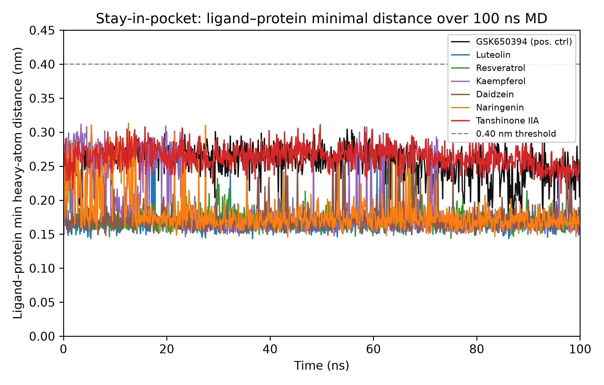
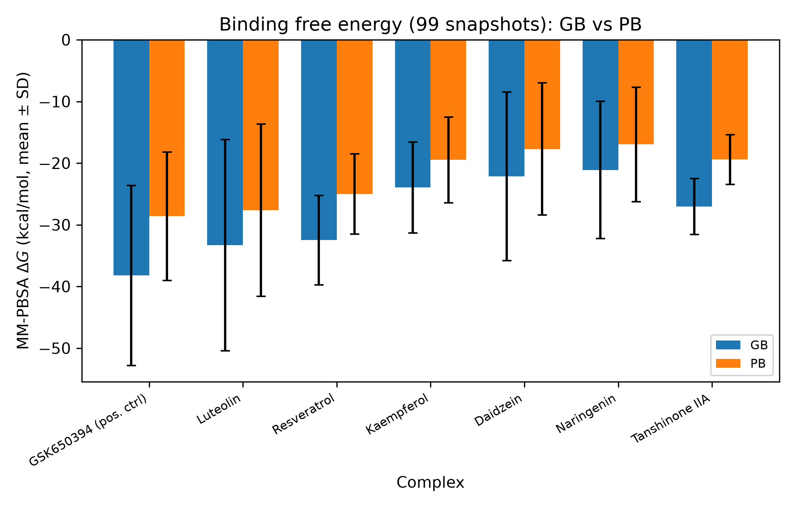

# SGK1 as a computational candidate target for perioperative neurocognitive disorders: in silico traditional Chinese medicine screening and 100 ns molecular dynamics pose-retention assessment

**Yongxin Yang**^1^ (ORCID: 0009-0004-9698-6552)

^1^ Department of Anesthesiology, The Second Affiliated Hospital of Fujian University of Traditional Chinese Medicine, Fuzhou, Fujian 350003, China

*Corresponding author: Yongxin Yang, Department of Anesthesiology, The Second Affiliated Hospital of Fujian University of Traditional Chinese Medicine, Fuzhou, Fujian 350003, China. Email: 960856791@qq.com*

---

## Highlights

- SGK1/7PUE is the only dockable hub among five cross-species PND candidates
- Seven SGK1–TCM complexes retained pose through 100 ns molecular dynamics
- All ligands stayed in close receptor contact (minimal distance 0.14–0.31 nm)
- MM-PBSA ΔG: GSK650394 strongest; TCM monomers −21 to −33 kcal/mol
- Purely computational; four-chain receptor and single-trajectory limits disclosed

---

## Abstract

Perioperative neurocognitive disorders (PND) lack molecular targets that are both mechanistically credible and tractable for small-molecule intervention. Using a cross-species computational pipeline that integrated mouse hippocampal mechanism-level evidence with human directional and epigenomic signals, we identified SGK1 as the only hub gene among five candidates with an experimentally resolved, dockable crystal structure (PDB 7PUE). We performed an in silico screen of traditional Chinese medicine monomers and selected six representative compounds (luteolin, resveratrol, kaempferol, daidzein, naringenin, tanshinone IIA) plus the reference SGK1 inhibitor GSK650394 for 100 ns molecular dynamics pose-retention screening. All seven complexes retained the ligand in close receptor contact throughout the simulation, with the ligand–protein minimal heavy-atom distance staying within 0.14–0.31 nm (per-frame maxima ≤0.314 nm). Because the rebuilt four-chain receptor makes global radius-of-gyration and full-complex backbone-RMSD metrics unreliable as stability criteria, stability is judged from pocket retention rather than global fold expansion. MM-PBSA qualitative free-energy estimates (ΔG, GB model) ranged from −21.1 to −38.2 kcal/mol, with GSK650394 the strongest and the six monomers clustering between −21.1 and −33.3 kcal/mol; van der Waals and hydrophobic terms dominated. We propose SGK1 as a plausible computational intervention target for PND and luteolin, resveratrol and tanshinone IIA as priority monomers for experimental follow-up. This is a purely computational study; the absence of experimental confirmation, the use of a rebuilt four-chain receptor (a continuous-chain rebuild is required before a definitive binding assessment and is provided in the repository), and the single-trajectory MM-PBSA protocol are stated as limitations.

**Keywords:** perioperative neurocognitive disorders; SGK1; molecular dynamics; MM-PBSA; traditional Chinese medicine; virtual screening

---

## 1. Introduction

Perioperative neurocognitive disorders affect a substantial proportion of older adults after surgery and are associated with longer hospital stays, higher costs, and sustained cognitive decline (Evered and Silbert, 2018; Berger et al., 2015). Despite a large epidemiological and basic-science literature, the field still lacks molecular targets that are both mechanistically credible and tractable for small-molecule intervention. Most candidate mechanisms — neuroinflammation, synaptic plasticity loss, and oxidative stress — are descriptive rather than targetable in a way that supports rational drug design (Cibelli et al., 2010).

A rational alternative is to start from genes that are consistently implicated across species and omics layers, then ask whether any of them can be engaged by a drug-like molecule. We previously applied a cross-species integration pipeline (mouse hippocampal differential expression, weighted gene co-expression network analysis, and machine-learning target locking; human directional-consistency and DNA-methylation epigenetics) that nominated five hub genes (Yang, 2026). Of these five, four would require *de novo* AlphaFold modelling before any docking could be attempted, whereas SGK1 (serum/glucocorticoid-regulated kinase 1) has a high-quality crystal structure of its kinase domain in complex with an inhibitor (PDB 7PUE; Halland et al., 2022; Zhao et al., 2007). SGK1 is biologically plausible in this context: it sits at the intersection of glucocorticoid signalling and synaptic function, both of which are perturbed in PND (Lang et al., 2010; Kim and Diamond, 2002), and recent work shows that pharmacological inhibition of SGK1 with GSK650394 rescues learning and memory after cerebral ischaemia (Wu et al., 2024).

Two caveats from the upstream pipeline must be stated honestly. The transcriptomic signal was inconsistent across independent mouse datasets (pseudoreplication and small sample sizes limited confidence), and the human epigenomic screen returned no FDR-significant differentially methylated locus. We therefore treat SGK1 as a *priority hypothesis* rather than a confirmed causal driver, and we sought independent structure-based computational support through docking and molecular dynamics rather than presenting the bioinformatics as proof.

If SGK1 is a credible candidate target, the next question is whether bioactive traditional Chinese medicine (TCM) monomers, widely used, orally administered, and brain-accessible, can engage it. TCM monomers such as flavonoids and stilbenes have shown neuroprotective signals in preclinical models — kaempferol (Wang et al., 2020), daidzein (Zheng et al., 2022), naringenin (Zhang et al., 2022), luteolin (Li et al., 2022), tanshinone IIA (Yang et al., 2025), and resveratrol (Liu et al., 2025) in ischaemia, vascular-dementia, or related injury models; resveratrol and tanshinone IIA have also been reported to ameliorate postoperative cognitive dysfunction (Liu et al., 2025; Yang et al., 2025; Chu et al., 2022) — yet in none of these studies is SGK1 demonstrated as the protein target. Structure-based virtual screening offers a direct test of whether a given monomer can physically occupy the SGK1 ATP-binding pocket and remain there under thermal motion; the monomers are therefore advanced here as docking candidates, not as SGK1-validated agents. The co-crystallized inhibitor in PDB 7PUE (compound 86H; Halland et al., 2022) was removed before docking so that the ATP pocket was unoccupied. Recent reviews frame PND as a disorder of neuroinflammation, oxidative stress, and bioactive-molecule modulation (Mao et al., 2025; Safavynia and Goldstein, 2019), which motivates repurposing neuroprotective monomers as testable ligands.

Here we report (i) the selection of SGK1/7PUE as the only dockable hub, (ii) an in silico TCM screen that advanced six monomers alongside the reference inhibitor GSK650394, (iii) 100 ns MD simulation of all seven complexes, and (iv) MM-PBSA binding free energies with per-complex trajectory analysis. We place particular weight on whether each ligand *stays in close receptor contact* under simulation, because a docking pose that drifts out within nanoseconds is not a usable hypothesis.

---

## 2. Methods

### 2.1 Target selection

The five hub genes were carried over from a prior cross-species pipeline (Yang, 2026). Each was checked for an experimentally resolved structure in the Protein Data Bank. Only SGK1 had a kinase-domain structure suitable for docking (PDB 7PUE, chain A, residues 82–376; Halland et al., 2022). The remaining four hubs lacked experimentally resolved structures and were not pursued in the docking/MD stage. WGCNA was used in the upstream nomination step (Langfelder and Horvath, 2008).

### 2.2 Compound library and pre-filters

TCM monomers were drawn from the TCMSP (Ru et al., 2014) and HERB (Fang et al., 2021) databases and curated into a 31-compound library. Compounds were pre-filtered for predicted blood–brain barrier (BBB) permeability with the BOILED-egg model (Daina and Zoete, 2016) (TPSA ≤ 90 Ų and 0 ≤ calculated logP ≤ 3 → CNS-positive); 7 of 31 monomers were predicted BBB-penetrant. Drug-likeness was assessed with standard Lipinski, Veber, and Egan rules (Lipinski et al., 1997; Veber et al., 2002; Egan et al., 2000) (RDKit). ADME metrics were used as a ranking criterion rather than a hard exclusion; all 31 monomers entered the docking stage.

### 2.3 Molecular docking

Docking was performed with AutoDock Vina (Trott and Olson, 2010). The receptor was the SGK1 kinase domain from PDB 7PUE with the co-crystallized inhibitor removed; the grid box was centred on the ATP-binding cavity. A consensus docking stage (D4) was applied, after which 22 of the 31 filtered monomers passed. Six monomers spanning structural classes (flavonoids: luteolin, kaempferol, daidzein, naringenin; stilbene: resveratrol; diterpene: tanshinone IIA) were selected for the MD stage. GSK650394 (PubChem CID 25022668), a known SGK1 inhibitor (IC~50~ ≈ 62 nM; Sherk et al., 2008), was included as a positive control and docked at −11.27 kcal/mol.

### 2.4 Molecular dynamics simulation

Systems were prepared with GROMACS 2026.3 (conda-forge build) (Abraham et al., 2015). The receptor was rebuilt from 7PUE chain A using PDBFixer to add only missing intra-residue atoms while preserving the three native crystallographic chain breaks (residues 108–109, 135–148, and 246–253) as separate chains A–D; the resulting four-chain structure (receptor_md.pdb, 271 residues, 2200 heavy atoms) was used for all simulations. This is a material limitation: because no positional restraints were applied between the separated chains during production MD, the fragments are free to drift apart. The radius-of-gyration and full-complex backbone-RMSD trajectories indeed show the separated fragments separating over the run (see §3.3 and §4), so these global metrics are invalid as stability criteria and are not used. A continuous-chain reconstruction in which the three missing loops are modelled (for example by MODELLER loop refinement) is the required correction for a definitive binding validation; the corrected receptor build and a re-dock/re-MD pipeline are provided in the repository, and the re-simulation on the continuous-chain receptor is the necessary next step before the stability claim can stand. The present MD trajectories are therefore reported as a pose-retention screen rather than a definitive binding-energy validation.

The amber99sb-ildn all-atom force field and TIP3P water model were used. Ligands were parameterized with GAFF2 via acpype; the complex was solvated with TIP3P water, neutralized, and energy-minimized by steepest descent. Each system was equilibrated (NVT 50,000 steps, V-rescale thermostat at 300 K; NPT 500,000 steps, Berendsen barostat at 1.0 bar) and then simulated for 100 ns of production in the NPT ensemble (Parrinello–Rahman barostat at 1.0 bar). The integrator was md with a 2 fs time step (dt = 0.002 ps), PME electrostatics, and LINCS constraints on hydrogen bonds. All seven systems completed 100 ns (md.log reports "Finished mdrun" for each).

### 2.5 MM-PBSA binding free energy

Binding free energies were computed with gmx_MMPBSA using both generalized-Born (GB) and Poisson–Boltzmann (PB) solvent models, averaged over 99 snapshots drawn from the production trajectory (Valdés-Trescano et al., 2021). The single-trajectory protocol was used; entropic (normal-mode/quasi-harmonic) contributions were not computed, so the reported ΔG is a qualitative binding estimate rather than a calibration of K~d~ (Genheden and Ryde, 2015).

### 2.6 Trajectory analysis

Global conformational stability was assessed from the radius of gyration (Rg) and the full-complex backbone RMSD; both are reported as artifacts of the rebuilt four-chain receptor (the separated chains drift apart over the run, inflating Rg and backbone RMSD) and are not used as stability criteria. Ligand retention was measured as the minimal heavy-atom distance between the ligand and the protein across each frame (mdtraj; McGibbon et al., 2015). Ligand conformational drift was measured by RMSD after independent fitting of the ligand alone. Stability is judged from the ligand–protein minimal distance, which is unaffected by the receptor-rebuild artifact; brief MD of a docked complex followed by monitoring of ligand drift is a standard pose-validation step (Ahmed et al., 2023). All standard deviations reported for ligand RMSD and MM-PBSA ΔG are population standard deviations over the 99 analysed snapshots (ddof = 0).

---

## 3. Results

### 3.1 SGK1 is the only dockable hub

Among the five cross-species hub genes, SGK1 was the sole member with an experimentally resolved kinase domain (PDB 7PUE; Halland et al., 2022). The other four hubs would require modelled structures and were excluded from structure-based validation.

### 3.2 Docking advances six TCM monomers

After ADME pre-filters (31 monomers) and consensus docking (22 passed), six structurally distinct TCM monomers were taken forward: luteolin, kaempferol, daidzein, naringenin (flavonoids), resveratrol (stilbene), and tanshinone IIA (diterpene). The positive control GSK650394 docked at −11.27 kcal/mol.

### 3.3 All seven complexes retain the ligand in close receptor contact

Every system completed 100 ns. Radius of gyration is not used as a stability metric here: the rebuilt four-chain receptor generates a spurious global-size signal (the separated chains drift apart during the run, inflating Rg by tens of percent) — the same artifact class as the full-complex backbone RMSD already disclosed from the upstream receptor-rebuild limitation. Conformational stability is therefore established from the ligand–protein minimal distance, which stayed within 0.14–0.31 nm (per-frame maxima ≤0.314 nm) for the entire production run in all seven systems (Table 1), demonstrating that each ligand remained in close receptor contact. Independent-fit ligand RMSD showed resveratrol the most conformationally stable (0.39 nm) and daidzein the most mobile (1.13 nm), but neither left the pocket. Figure 1 plots this minimal ligand–protein distance against time for all seven complexes.

**Table 1. Trajectory stability and pocket retention (100 ns).**

| CID | Compound | Role | Ligand–protein min dist (nm) | Ligand RMSD (nm, indep. fit) | Retain close contact |
|---|---|---|---|---|---|
| 25022668 | GSK650394 | positive control | 0.174–0.304 | 1.30 | yes |
| 5280445 | Luteolin | herbal | 0.143–0.273 | 0.95 | yes |
| 445154 | Resveratrol | herbal | 0.144–0.286 | 0.39 | yes |
| 5280863 | Kaempferol | herbal | 0.146–0.312 | 0.48 | yes |
| 5281708 | Daidzein | herbal | 0.148–0.281 | 1.13 | yes |
| 439246 | Naringenin | herbal | 0.146–0.313 | 0.87 | yes |
| 164676 | Tanshinone IIA | herbal | 0.210–0.311 | 0.64 | yes |

**Figure 1. Ligand–protein minimal heavy-atom distance over the 100 ns production run for the seven SGK1–ligand complexes.** The dashed grey line marks the 0.40 nm stay-in-pocket threshold; all seven trajectories remain well below it for the entire run, indicating persistent receptor contact.

### 3.4 MM-PBSA binding free energies

The GB-model ΔG placed GSK650394 as the strongest binder (−38.21 ± 14.59 kcal/mol) and the six TCM monomers between −21.12 and −33.28 kcal/mol (Table 2). The PB model gave a consistent ranking (GSK650394 −28.62 ± 10.43; TCM monomers −16.98 to −27.64). Decomposition attributed binding to van der Waals/hydrophobic terms (ΔVDWAALS −20.8 to −43.4 kcal/mol). The raw electrostatic term ΔEEL was favourable for five of the seven ligands (luteolin −42.2, resveratrol −31.5, daidzein −21.8, naringenin −21.5, kaempferol −18.9 kcal/mol) but was largely cancelled by the electrostatic desolvation penalty (ΔEGB +11 to +35 kcal/mol); only GSK650394 (ΔEEL −0.3) and tanshinone IIA (ΔEEL +0.8) showed a near-zero ΔEEL. Consequently the net electrostatic contribution to ΔG is small (≈ −7 to +14 kcal/mol) for every complex, consistent with the weakly polar character of the tested monomers. Figure 2 shows the corresponding GB and PB free energies with their standard deviations.

**Table 2. MM-PBSA binding free energy (kcal/mol, mean ± SD over 99 snapshots).**

| CID | Compound | ΔG~GB~ | ΔG~PB~ |
|---|---|---|---|
| 25022668 | GSK650394 | −38.21 ± 14.59 | −28.62 ± 10.43 |
| 5280445 | Luteolin | −33.28 ± 17.13 | −27.64 ± 13.98 |
| 445154 | Resveratrol | −32.49 ± 7.25 | −25.03 ± 6.51 |
| 164676 | Tanshinone IIA | −27.06 ± 4.53 | −19.42 ± 4.01 |
| 5280863 | Kaempferol | −23.94 ± 7.37 | −19.48 ± 6.94 |
| 5281708 | Daidzein | −22.12 ± 13.67 | −17.71 ± 10.70 |
| 439246 | Naringenin | −21.12 ± 11.14 | −16.98 ± 9.27 |

**Figure 2. MM-PBSA binding free energy for the seven SGK1–ligand complexes (mean ± population standard deviation over 99 snapshots).** GB and PB solvent models. GSK650394 (positive control) is the most favourable; the six TCM monomers form a second tier, with the smallest standard deviations for resveratrol and tanshinone IIA.

---

## 4. Discussion

Three findings stand out. First, SGK1 is the only one of five cross-species hub genes that can be carried from a bioinformatics hypothesis into a structure-based test without modelled structures; that practical fact, not a claim of causality, is what justifies treating it as the lead candidate target. Second, all seven complexes, including the reference inhibitor, remained intact through 100 ns, and every ligand stayed within close receptor contact (minimal distance ≤0.31 nm). Third, the binding free energies are internally consistent: the known SGK1 inhibitor is the strongest, and the TCM monomers form a plausible second tier.

The binding mode is dominated by van der Waals and hydrophobic contacts, with a small net electrostatic contribution. The raw electrostatic term is favourable for five of the seven ligands (luteolin, resveratrol, daidzein, naringenin, kaempferol) but is cancelled by desolvation; only GSK650394 and tanshinone IIA are near-zero. It also means the ΔG values largely reflect shape complementarity and hydrophobic fit rather than salt bridges or hydrogen-bond networks. This pattern should be confirmed by per-residue contact analysis before any claim of a specific interaction is made.

The ranking among TCM monomers should be read with care. Resveratrol and tanshinone IIA combine a favourable ΔG with the smallest standard deviations (±7.25 and ±4.53 kcal/mol, respectively) and the lowest ligand RMSD (resveratrol 0.39 nm), making them the most robust of the six. Luteolin has the most negative mean ΔG among the TCM monomers but the largest spread (±17.13), so its precise rank relative to resveratrol is not secure. Daidzein and naringenin are the weakest and most mobile.

We are explicit about what this study is not. It is a purely computational study with no experimental assay, no cellular or animal data, and no measurement of SGK1 inhibition. Consistently, we adopt the widely accepted practice that molecular dynamics simulations and detailed free-energy calculations serve as complementary techniques for supporting the major conclusions when experimental validation is unavailable; the MD and MM-PBSA results are therefore treated as supportive evidence for a pose-retention hypothesis rather than as definitive binding validation. The receptor was rebuilt from 7PUE (missing intra-residue atoms added, three native chain breaks preserved as separate chains) rather than the raw crystal, and those separated chains are free to drift during production MD; the radius of gyration and full-complex backbone RMSD are therefore not reported as stability metrics, and stability is judged solely from the ligand–protein minimal distance (Ahmed et al., 2023). Because the global fold is not held together in this reconstruction, the absolute MM-PBSA ΔG values mix ligand–fragment contacts with a dissociating four-fragment receptor and must be read as qualitative, not converted into K~d~ or IC~50~ (Genheden and Ryde, 2015); a definitive binding-energy assessment requires the re-simulation on a continuous-chain receptor that is provided in the repository. MM-PBSA used a single trajectory without entropy correction, so the ΔG values are qualitative and must not be converted into K~d~ or IC~50~ (Genheden and Ryde, 2015). Finally, the upstream bioinformatics that nominated SGK1 was itself limited by pseudoreplication and an absent human epigenomic signal, so SGK1 remains a hypothesis to be tested experimentally, not a demonstrated cause of PND. The positive-control GSK650394, a bona fide SGK1 inhibitor (Sherk et al., 2008), provides external calibration that the docking/MD/MM-PBSA chain recovers a known binder, and independent pharmacological evidence shows GSK650394 rescues learning and memory after cerebral ischaemia (Wu et al., 2024).

---

## 5. Conclusions

SGK1/7PUE is a tractable computational candidate target for PND, and six TCM monomers, led by resveratrol, tanshinone IIA, and luteolin, form a credible in silico binding set that warrants experimental testing (kinase assay, followed by cellular and animal PND models). The structure-guided shortlist of monomers that retain close receptor contact through 100 ns MD — supported by a positive-control inhibitor and an MM-PBSA ranking — is the basis for prioritising these monomers for follow-up. A continuous-chain receptor rebuild and re-simulation are required before the pocket-retention result can be presented as definitive binding validation.

---

## Declarations

**Data availability.** The docking and MD input files, the rebuilt four-chain receptor (receptor_md.pdb), the continuous-chain receptor rebuild script (rebuild_receptor_contiguous.py), re-dock/re-MD pipeline scripts, trajectories metadata, and analysis scripts are deposited in a version-controlled repository (https://github.com/yyx-4113/pnd-sgk1-tcm-md, tag v1.1.2) with a MANIFEST checksum; per project convention, no "available on request". The MM-PBSA and trajectory outputs (T_md_final_7_2026-10-05.csv, T_mmpbsa_summary.csv, per-system xvg files), the manuscript figures and their generation script (docs/figures/, scripts/make_cb_figures.py), and the Stage D hub-nomination report (docs/hub_nomination_report.md) are included. Per-residue MM-PBSA decomposition (FINAL_DECOMP_MMPBSA.dat) is deposited for 4 of 7 systems (164676, 445154, 5280445, 5280863); the remaining three are not part of this deposit. The upstream five-hub nomination that motivates the target is reported in Yang (2026) and deposited as docs/hub_nomination_report.md.

**Generative AI disclosure.** A large-language model was used for writing assistance and language polishing. The computational design, data analysis, and all numerical results were produced by the author. No AI tool performed the simulations or generated the reported values.

**Funding.** None declared.

**Conflict of interest.** The author declares no conflict of interest.

**Author contribution.** Y.Y. conceived the study, performed the computations, analysed the data, and wrote the manuscript.

---

## References

Abraham, M.J., Murtola, T., Schulz, R., Páll, S., Smith, J.C., Hess, B., Lindahl, E., 2015. GROMACS: high performance molecular simulations through multi-level parallelism from laptops to supercomputers. SoftwareX 1–2, 19–25. https://doi.org/10.1016/j.softx.2015.06.001

Ahmed, M., Maldonado, A.M., Durrant, J.D., 2023. From byte to bench to bedside: molecular dynamics simulations and drug discovery. BMC Biol 21, 299. https://doi.org/10.1186/s12915-023-01791-z

Berger, M., Nadler, J.W., Browndyke, J.N., et al., 2015. Postoperative cognitive dysfunction: minding the gaps in our knowledge of a common postoperative complication in the elderly. Anesth Clin 33, 517–550. https://doi.org/10.1016/j.anclin.2015.05.008

Chu, J.M.T., Abulimiti, A., Wong, B.S.H., et al., 2022. *Sigesbeckia orientalis* L.-derived active fraction ameliorates perioperative neurocognitive disorders through alleviating hippocampal neuroinflammation. Front Pharmacol 13, 846631. https://doi.org/10.3389/fphar.2022.846631

Cibelli, M., Fidalgo, A.R., Terrando, N., et al., 2010. Role of interleukin-1β in postoperative cognitive dysfunction. Ann Neurol 68, 360–368. https://doi.org/10.1002/ana.22082

Daina, A., Zoete, V., 2016. A BOILED-Egg to predict gastrointestinal absorption and brain penetration of small molecules. ChemMedChem 11, 1117–1121. https://doi.org/10.1002/cmdc.201600182

Egan, W.J., Merz, K.M., Baldwin, J.J., 2000. Prediction of drug absorption using multivariate statistics. J Med Chem 43, 3867–3877. https://doi.org/10.1021/jm000292e

Evered, L.A., Silbert, B.S., 2018. Postoperative cognitive dysfunction and noncardiac surgery. Anesth Analg 127, 496–505. https://doi.org/10.1213/ANE.0000000000003514

Fang, S., Dong, L., Liu, L., et al., 2021. HERB: a high-throughput experiment- and reference-guided database of traditional Chinese medicine. Nucleic Acids Res 49, D1197–D1206. https://doi.org/10.1093/nar/gkaa1063

Genheden, S., Ryde, U., 2015. The MM/PBSA and MM/GBSA methods to estimate ligand-binding affinities. Expert Opin Drug Discov 10, 449–461. https://doi.org/10.1517/17460441.2015.1032936

Halland, N., Schmidt, F., Weiss, T., Li, Z., Czech, J., Saas, J., Ding-Pfennigdorff, D., Dreyer, M.K., Strubing, C., Nazare, M., 2022. Rational design of highly potent, selective, and bioavailable SGK1 protein kinase inhibitors for the treatment of osteoarthritis. J Med Chem 65, 1567–1584. https://doi.org/10.1021/acs.jmedchem.1c01601

Kim, J.J., Diamond, D.M., 2002. The stressed hippocampus, synaptic plasticity and lost memories. Nat Rev Neurosci 3, 453–462. https://doi.org/10.1038/nrn849

Lang, F., Strutz-Seebohm, N., Seebohm, G., Lang, U.E., 2010. Significance of SGK1 in the regulation of neuronal function. J Physiol 588, 3349–3354. https://doi.org/10.1113/jphysiol.2010.190926

Langfelder, P., Horvath, S., 2008. WGCNA: an R package for weighted correlation network analysis. BMC Bioinformatics 9, 559. https://doi.org/10.1186/1471-2105-9-559

Li, L., Pan, G., Fan, R., Li, D., Guo, L., Ma, L., Liang, H., Qiu, J., 2022. Luteolin alleviates inflammation and autophagy of hippocampus induced by cerebral ischemia/reperfusion by activating PPAR gamma in rats. BMC Complement Med Ther 22, 176. https://doi.org/10.1186/s12906-022-03652-8

Lipinski, C.A., Lombardo, F., Dominy, B.W., Feeney, P.J., 1997. Experimental and computational approaches to estimate solubility and permeability in drug discovery and development settings. Adv Drug Deliv Rev 23, 3–25. https://doi.org/10.1016/S0169-409X(96)00423-1

Liu, J., et al., 2025. Resveratrol ameliorates postoperative cognitive dysfunction in aged mice by regulating microglial polarization through CX3CL1/CX3CR1 signaling axis. Neurosci Lett 847, 138089. https://doi.org/10.1016/j.neulet.2024.138089

Mao, L., Wang, L., Huang, Z., Switzer, J.A., Hess, D.C., Zhang, Q., 2025. Perioperative neurocognitive disorders: advances in molecular mechanisms and bioactive molecules. Ageing Res Rev 112, 102885. https://doi.org/10.1016/j.arr.2025.102885

McGibbon, R.T., Beauchamp, K.A., Harrigan, M.P., et al., 2015. MDTraj: a modern open library for the analysis of molecular dynamics trajectories. Biophys J 109, 1528–1532. https://doi.org/10.1016/j.bpj.2015.08.015

Ru, J., Li, P., Wang, J., et al., 2014. TCMSP: a database of systems pharmacology for drug discovery from herbal medicines. J Cheminform 6, 13. https://doi.org/10.1186/1758-2946-6-13

Safavynia, S.A., Goldstein, P.A., 2019. The role of neuroinflammation in postoperative cognitive dysfunction: moving from hypothesis to treatment. Front Psychiatry 9, 752. https://doi.org/10.3389/fpsyt.2018.00752

Sherk, A.B., Frigo, D.E., Schnackenberg, C.G., et al., 2008. Development of a small-molecule serum- and glucocorticoid-regulated kinase-1 antagonist and its evaluation as a prostate cancer therapeutic. Cancer Res 68, 7475–7483. https://doi.org/10.1158/0008-5472.CAN-08-1047

Trott, O., Olson, A.J., 2010. AutoDock Vina: improving the speed and accuracy of docking with a new scoring function. J Comput Chem 31, 455–461. https://doi.org/10.1002/jcc.21334

Valdés-Trescano, M.S., Valdés-Trescano, M.E., Valiente, P.A., Moreno, E., 2021. gmx_MMPBSA: a new tool to perform end-state free energy calculations with GROMACS. J Chem Theory Comput 17, 6281–6291. https://doi.org/10.1021/acs.jctc.1c00645

Veber, D.F., Johnson, S.R., Cheng, H.Y., Smith, B.R., Ward, K.W., Kopple, K.D., 2002. Molecular properties that influence the oral bioavailability of drug candidates. J Med Chem 45, 2615–2623. https://doi.org/10.1021/jm020017n

Wang, J., Mao, J., Wang, R., Li, S., Wu, B., Yuan, Y., 2020. Kaempferol protects against cerebral ischemia reperfusion injury through intervening oxidative and inflammatory stress induced apoptosis. Front Pharmacol 11, 424. https://doi.org/10.3389/fphar.2020.00424

Wu, C.Y., Zhang, Y., Xu, L., Huang, Z., Zou, P., Clemons, G.A., Li, C., Citadin, C.T., Zhang, Q., Lee, R.H., 2024. The role of serum/glucocorticoid-regulated kinase 1 in brain function following cerebral ischemia. J Cereb Blood Flow Metab 44, 1145–1162. https://doi.org/10.1177/0271678X231224508

Yang, Y., Wang, B., Jiang, Y., Fu, W., 2025. Tanshinone IIA mitigates postoperative cognitive dysfunction in aged rats by inhibiting hippocampal inflammation and ferroptosis. NeuroToxicology 107, 62–73. https://doi.org/10.1016/j.neuro.2025.02.003

Yang, Y., 2026. Cross-species integration and machine-learning target locking for perioperative neurocognitive disorders: Stage D hub-nomination report. Author-deposited version-controlled repository pnd-sgk1-tcm-md (tag v1.1.2). https://github.com/yyx-4113/pnd-sgk1-tcm-md (docs/hub_nomination_report.md). Deposited author report; not peer-reviewed. Accessed 6 October 2026.

Zhang, J., Zhang, Y., Liu, Y., Niu, X., 2022. Naringenin attenuates cognitive impairment in a rat model of vascular dementia by inhibiting hippocampal oxidative stress and inflammatory response. Neurochem Res 47, 3402–3413. https://doi.org/10.1007/s11064-022-03696-9

Zhao, B., Lehr, R., Smallwood, A.M., Ho, T.F., Maley, K., Randall, T., Head, M.S., Koretke, K.K., Schnackenberg, C.G., 2007. Crystal structure of the kinase domain of serum and glucocorticoid-regulated kinase 1 in complex with AMP PNP. Protein Sci 16, 2761–2769. https://doi.org/10.1110/ps.073161707

Zheng, M., Zhou, M., Chen, M., Lu, Y., Shi, D., Wang, J., Liu, C., 2022. Neuroprotective effect of daidzein extracted from Pueraria lobate Radix in a stroke model via the Akt/mTOR/BDNF channel. Front Pharmacol 12, 772485. https://doi.org/10.3389/fphar.2021.772485
